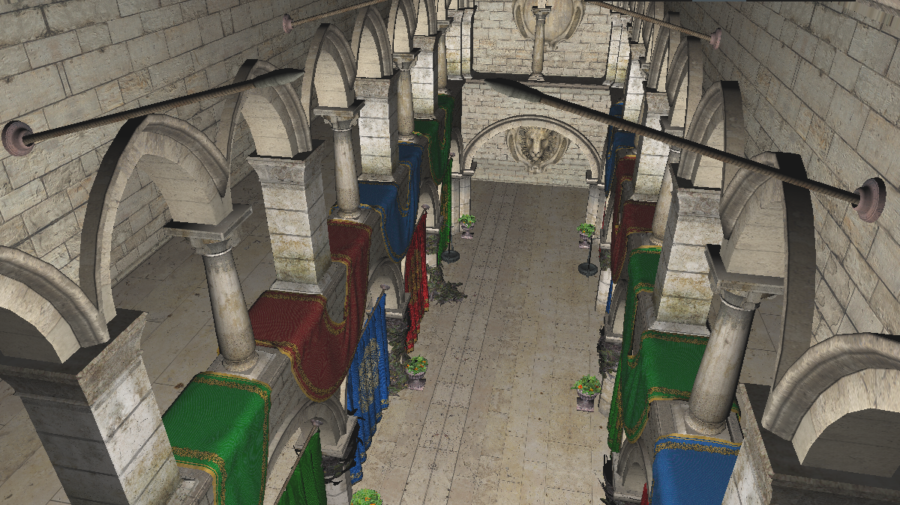
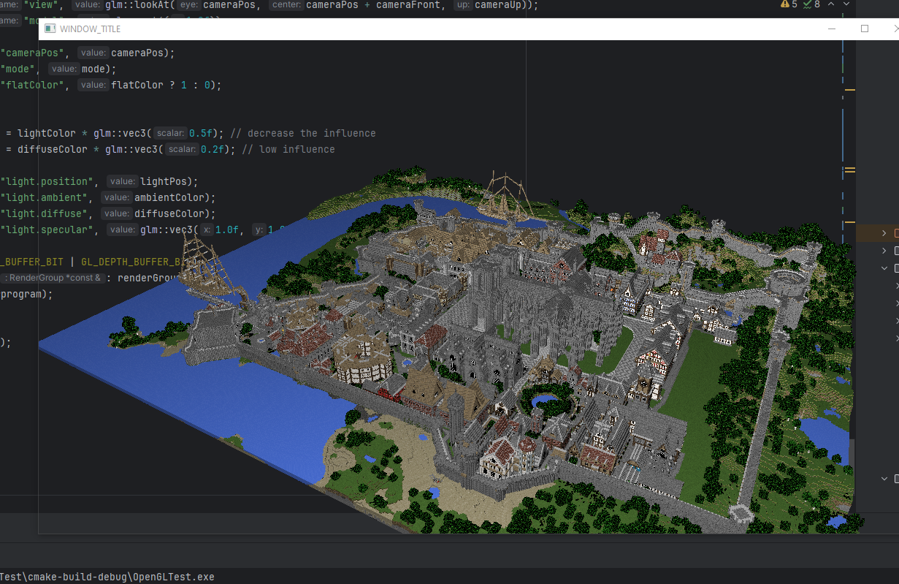

# OpenGL Renderer for Obj/Mtl files

## Summary 
This project was created mainly to learn more about c++ and opengl. Obj
files are parsed with the library tinyobjloader and rendered using opengl,
glad and glm. Background is transparent since I thought it looked cool.

### Basic info
- WASD to move camera
- Mouse to look around 
- 1,2 to change rendering mode
- L to position light source at camera pos
- Left shift/ Left CTRL to increase speed
- R to render wireframe
- Esc to quit

## Examples of Use

###  Sponza

### Rungholt

Models downloaded from Morgan McGuire's [Computer Graphics Archive](https://casual-effects.com/data)